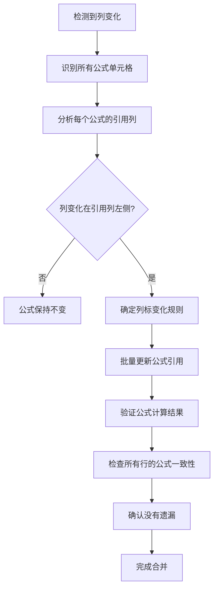

# OpenDocument Spreadsheet (.ods/.fods) 冲突解决指南

## 概述
本指南提供解决 OpenDocument Spreadsheet 文件（.ods, .fods）Git 冲突的系统性方法和最佳实践。基于实际合并经验总结，帮助快速准确地解决表格文件冲突。

## 适用场景
- 合并包含 .ods 或 .fods 文件的 Git 分支
- 处理电子表格的结构性冲突（列/行变化）
- 解决表格数据的版本冲突

---

## 核心原则

### 1. 全面理解冲突来源

在解决冲突前，必须理解三个版本的内容：

- **BASE**：共同祖先版本
- **LOCAL（HEAD）**：当前分支的修改
- **REMOTE**：要合并的分支的修改

**关键任务**：
- 识别每个版本的具体变更
- 理解变更的业务意图
- 确定冲突的性质（结构性 vs 数据性）

### 2. 识别冲突类型

#### 元数据冲突
- 编辑时间、统计信息
- 视图设置（可见区域、缩放）
- 打印机设置
- **处理原则**：不影响实际数据，保留合适版本即可

#### 结构冲突（关键）
- 列数变化（新增/删除列）
- 行数变化（新增/删除行）
- 表格结构重组
- **处理原则**：需要手动整合，确保结构完整性

#### 数据冲突
- 同一单元格的不同值
- 格式差异
- **处理原则**：根据业务逻辑选择，考虑保留双方修改

#### 公式冲突
- 公式内容变化
- 引用范围变化
- 因行列变化导致的失效
- **处理原则**：调整公式引用，确保计算正确

---

## 冲突解决流程

### 步骤 1：收集信息
```bash
# 查看 Git 状态
git status

# 识别冲突文件
git diff --name-only --diff-filter=U
```

**操作**：
- 读取当前冲突文件（包含冲突标记）
- 并行读取 .BASE、.LOCAL、.REMOTE 三个版本
- 记录所有冲突位置

### 步骤 2：分析冲突
对于每个冲突点，分析：

1. **冲突位置**：在文件中的哪个部分
2. **变更内容**：BASE → LOCAL 和 BASE → REMOTE 分别改了什么
3. **影响范围**：是否影响其他单元格、公式
4. **业务意义**：这个变更的目的是什么

### 步骤 3：制定合并策略

#### 策略决策树

```
结构变化？
├─ 是 → 采用新结构
│   ├─ 新增列/行？
│   │   ├─ 是 → 调整所有相关行/列
│   │   └─ 否 → 检查数据完整性
│   └─ 删除列/行？
│       └─ 确认数据是否需要保留
└─ 否 → 仅数据冲突
    ├─ 优先保留有意义的修改
    └─ 合并互补性修改
```

### 步骤 4：执行合并

#### 顺序处理原则
1. **先处理结构性冲突**（列、行变化）
2. **再处理数据冲突**（单元格值）
3. **最后处理元数据冲突**（时间戳、配置）
4. **最后检查公式**（确保引用正确）

#### 合并操作要点

**新增列的情况**：
- 确保所有行都有对应数量的列
- 新增行缺少的列用空单元格填充
- 检查受影响的公式引用

**示例**：
```xml
<!-- 原始 3 列结构 -->
<table:table-cell>value1</table:table-cell>
<table:table-cell>value2</table:table-cell>
<table:table-cell>formula</table:table-cell>

<!-- 新增第 3 列后的 4 列结构 -->
<table:table-cell>value1</table:table-cell>
<table:table-cell>value2</table:table-cell>
<table:table-cell/>  <!-- 空单元格 -->
<table:table-cell>formula</table:table-cell>
```

### 步骤 5：验证合并结果

**检查清单**：
- [ ] 所有冲突标记已清除
- [ ] 每行的列数一致
- [ ] 表头和列数匹配
- [ ] 公式引用正确（行列变化后需调整）
- [ ] 新增行的数据完整
- [ ] 文件可以正常打开

### 步骤 6：提交修正

```bash
# 添加修改的文件
git add <文件名>

# 删除临时文件
del <文件名>.BASE.* <文件名>.LOCAL.* <文件名>.REMOTE.*

# 继续 cherry-pick 或合并
git cherry-pick --continue

# 如果发现错误，修正后使用
git add <文件名>
git commit --amend --no-edit
```

---

## 常见错误及避免方法

### 错误 1：只看冲突标记，不理解业务逻辑

**问题**：机械地选择 HEAD 或 REMOTE，导致数据丢失

**解决**：
- 读取并理解所有版本
- 分析变更的业务意图
- 根据实际需求选择

### 错误 2：忽略新增行/列带来的结构变化

**问题**：列数不一致导致数据错位

**示例错误**：
```xml
<!-- 第 5 行：LOCAL 新增，只有 3 列 -->
<table:table-cell>14</table:table-cell>
<table:table-cell>102</table:table-cell>
<table:table-cell>formula</table:table-cell>

<!-- 应该是 4 列，缺第 3 列 -->
```

**正确做法**：
```xml
<!-- 补全到 4 列 -->
<table:table-cell>14</table:table-cell>
<table:table-cell>102</table:table-cell>
<table:table-cell/>  <!-- 空单元格 -->
<table:table-cell>formula</table:table-cell>
```

### 错误 3：没有调整公式引用

**问题**：新增行后，公式引用错误

**示例**：
```xml
<!-- 新增第 5 行后，原第 5 行变成第 6 行 -->
<!-- 公式需要更新 -->
<table:table-cell table:formula="of:=[.A6]+[.B6]">118</table:table-cell>
```

### 错误 4：没有验证合并结果

**问题**：提交后才发现数据错误

**解决**：
- 合并后读取文件检查
- 使用表格软件打开验证
- 检查公式计算结果

---

## OpenDocument 文件结构速查

### 关键 XML 标签

```xml
<!-- 表格定义 -->
<table:table table:name="工作表1">
  <!-- 列定义 -->
  <table:table-column table:number-columns-repeated="4"/>
  
  <!-- 行定义 -->
  <table:table-row>
    <!-- 单元格 -->
    <table:table-cell office:value-type="float">
      <text:p>数值</text:p>
    </table:table-cell>
    
    <!-- 公式单元格 -->
    <table:table-cell table:formula="of:=[.A2]+[.B2]">
      <text:p>结果</text:p>
    </table:table-cell>
    
    <!-- 空单元格 -->
    <table:table-cell/>
  </table:table-row>
</table:table>
```

### 冲突标记格式

```xml
<<<<<<< HEAD
<本地版本的内容>
=======
<远程版本的内容>
>>>>>>> <提交哈希> (提交信息)
```

---

## 实战案例

### 案例：新增列 + 新增行的合并

**场景**：
- BASE：3 列（atk, hp, power），4 行数据
- LOCAL：3 列，新增第 5 行（14, 102）
- REMOTE：4 列（新增 def 列），5 行数据（def: 3,4,5,6）

**合并策略**：
1. 采用 4 列结构（atk, hp, def, power）
2. 保留 REMOTE 的 def 列数据
3. 保留 LOCAL 的新增第 5 行
4. 第 5 行的 def 列留空（因为 LOCAL 没有这个数据）

**结果**：
```
| atk | hp  | def | power |
|-----|-----|-----|-------|
| 12  | 100 | 3   | 112   |
| 13  | 101 | 4   | 114   |
| 14  | 102 | 5   | 116   |
| 14  | 102 | (空)| 116   | <- LOCAL 新增
| 15  | 103 | 6   | 118   |
```

**关键操作**：
- 调整所有行到 4 列
- 第 5 行第 3 列用空单元格
- 第 5 行第 4 列保留公式

---

## 快速参考清单

### 合并前
- [ ] 读取并理解 BASE、LOCAL、REMOTE
- [ ] 识别所有冲突位置
- [ ] 确定合并策略

### 合并中
- [ ] 先处理结构冲突（列/行）
- [ ] 再处理数据冲突
- [ ] 最后处理元数据冲突
- [ ] 检查并调整公式引用

### 合并后
- [ ] 验证每行列数一致
- [ ] 检查公式计算正确
- [ ] 确认文件可正常打开
- [ ] 清理临时文件
- [ ] 提交修正

---

## 工具和命令

### Git 命令
```bash
# 查看冲突
git status
git diff --name-only --diff-filter=U

# 放弃合并
git merge --abort
git cherry-pick --abort

# 继续合并
git add <文件>
git merge --continue
git cherry-pick --continue

# 修正最近提交
git add <文件>
git commit --amend --no-edit
```

### 文件操作
```bash
# 删除临时文件（Windows）
del *.BASE.* *.LOCAL.* *.REMOTE.*

# 删除临时文件（Linux/Mac）
rm *.BASE.* *.LOCAL.* *.REMOTE.*
```

---

## 公式冲突处理详解

### 概述
当表格包含公式时，列/行变化可能导致公式引用失效。本节提供系统性的公式冲突处理方法，确保合并后公式正常工作。

### 当前表格的公式模式分析

在处理公式冲突前，先理解当前表格的公式结构：

**示例表格（v1.fods）：**
- **Power 列（第4列）**：`=[.An]+[.Bn]` - 计算该行第1列(atk)和第2列(hp)的和
- **Def 列（第3列）**：纯数值，无公式
- **公式特点**：使用绝对行引用（`.A2`, `.B2`），引用列标而非列位置

**关键观察**：
- 公式使用列标引用（A, B），列标固定
- 公式不受右侧列位置影响
- 公式受引用列左侧的列变化影响

### 列变化场景及处理原则

#### 场景 1：在公式列之前插入新列

**原始结构（3列）：**
```
A(atk) | B(hp) | C(power=A+B)
```

**在第2列后插入 def 列（变为4列）：**
```
A(atk) | B(hp) | C(def) | D(power=A+B)
```

✅ **处理方式**：公式不需要修改
- 公式引用的是列标(A, B)，不是列位置
- 插入在引用列右侧，不影响公式

❌ **错误做法**：
```
错误公式：=[.An]+[.Cn]  (错误地引用了新列的位置)
正确公式：=[.An]+[.Bn]  (保持原列标)
```

---

#### 场景 2：在公式引用的列之前插入新列

**原始结构：**
```
A | B | C(power=A+B)
```

**在第1列前插入 new 列：**
```
A(new) | B(atk) | C(hp) | D(power)
```

✅ **处理方式**：需要更新所有公式引用
- 所有列标顺延：原 A→B, 原 B→C, 原 C→D
- 公式需要更新：`=[.Bn]+[.Cn]`

**批量更新操作**：
```bash
# A 列变为 B 列
sed -i 's/=\[\.A\[/=[\.B\[/g' v1.fods
# B 列变为 C 列
sed -i 's/=\[\.B\[/=[\.C\[/g' v1.fods
```

❌ **错误做法**：
```
未更新：=[.An]+[.Bn]  (会引用错误的列：A是new列，B是atk列)
正确：=[.Bn]+[.Cn]   (正确引用atk和hp列)
```

---

#### 场景 3：删除公式引用的列

**原始结构：**
```
A | B | C(power=A+B)
```

**删除第1列（A列）：**
```
A(hp) | B(power)  ← 需要重新设计公式
```

✅ **处理方式**：
- 重新评估公式逻辑
- 确认是否还需要这个公式
- 可能需要修改公式或调整业务逻辑

**决策流程**：
```
删除的列是公式必需的吗？
├─ 是 → 需要重新设计公式或放弃删除
└─ 否 → 更新公式引用
```

❌ **错误做法**：
```
保留原公式：=[.An]+[.Bn]  (引用的列已不存在)
结果：公式会报错或计算错误
```

---

#### 场景 4：合并时两端都有列变化

**BASE版本：**
```
A | B | C(power=A+B)
```

**LOCAL版本（第2列后插入）：**
```
A | B | C(power=A+B) | D(new)
```

**REMOTE版本（第1列后插入）：**
```
A | B(new) | C(hp) | D(power=A+C)
```

✅ **合并策略**：
1. **确定最终列结构**：A | B(new) | C(hp) | D(new) | E(power)
2. **识别所有公式单元格**：搜索 `table:formula=`
3. **更新所有公式引用**：
   - REMOTE的公式：`A+C` → `A+C` (不变，因为B列被删除)
   - LOCAL的公式：`A+B` → `A+C` (跳过新插入的B列)
4. **确保每行列数一致**：所有行都有5列

**处理步骤**：
```bash
# 1. 搜索所有公式
grep -n 'table:formula=' v1.fods

# 2. 分析每个公式的引用列
# 3. 根据最终列结构更新公式
# 4. 验证更新后的计算结果
```

---

### 关键原则

#### 1. 理解公式引用类型

**相对列引用**（推荐）：
```
[.A1]+[.B1]  - 列标固定，不受列位置影响
```
- 优点：插入/删除右侧列时不影响公式
- 缺点：左侧列变化时需要更新

**相对位置引用**（不推荐）：
```
使用偏移量 - 列变化时需要更新
```
- 优点：动态适应结构变化
- 缺点：容易被意外插入/删除影响

**建议**：始终使用列标引用 `[.A1]`，避免位置引用

---

#### 2. 列变化时的公式检查清单

```
□ 识别所有公式单元格（搜索 table:formula=）
□ 确定每个公式引用的列
□ 分析列变化位置（在引用列左侧/右侧）
□ 判断是否需要更新列标
□ 批量更新所有受影响的公式
□ 验证公式计算结果是否正确
□ 检查所有行的公式一致性
□ 确认没有遗漏的公式单元格
```

---

#### 3. 自动化公式更新规则

**列插入规则**：

| 插入位置 | 列标变化 | 公式影响 | 需要修改 |
|---------|---------|---------|---------|
| 在第1列前 | A→B, B→C, C→D... | 所有引用受影响 | ✅ 需要更新 |
| 在A列和B列之间 | B→C, C→D... | B及右侧受影响 | ✅ 需要更新 |
| 在公式列之前 | 公式列标变化 | 公式列标需要更新 | ✅ 需要更新 |
| 在引用列右侧 | 列标不变 | 公式不受影响 | ❌ 保持不变 |

**列删除规则**：

| 删除位置 | 列标变化 | 公式影响 | 需要修改 |
|---------|---------|---------|---------|
| 删除A列 | B→A, C→B, D→C... | 所有引用受影响 | ✅ 需要更新 |
| 删除引用列 | 列不再存在 | 公式失效 | ✅ 重新设计 |
| 删除公式列 | 列标变化 | 公式单元格删除 | ⚠️ 检查依赖 |
| 删除右侧列 | 列标不变 | 公式不受影响 | ❌ 保持不变 |

---

### 本次合并的实际应用

**当前表格公式分析（v1.fods）：**

| 行号 | atk(A) | hp(B) | def(C) | power(D) | 公式 |
|-----|-------|------|--------|---------|------|
| 2   | 12    | 100  | 3      | 112     | A2+B2 |
| 3   | 13    | 101  | 4      | 114     | A3+B3 |
| 4   | 14    | 102  | 5      | 116     | A4+B4 |
| 5   | 14    | 102  | (空)   | 116     | A5+B5 |
| 6   | 15    | 103  | 6      | 118     | A6+B6 |

**公式特点**：
- 所有 power 列的公式：`=[.An]+[.Bn]` (n为行号)
- 引用的是第1列(atk)和第2列(hp)
- 公式列是第4列

**未来列变化的影响预测：**

| 插入位置 | 对公式的影响 | 原公式 | 新公式 | 需要修改 |
|---------|------------|--------|--------|---------|
| 在第1列前 | 列标顺延 | A+B | B+C | ✅ 需要 |
| 在第2列前 | B→C | A+B | A+C | ✅ 需要 |
| 在第3列前 | 不影响 | A+B | A+B | ❌ 不需要 |
| 在第4列前 | 不影响 | A+B | A+B | ❌ 不需要 |
| 在第4列后 | 不影响 | A+B | A+B | ❌ 不需要 |

---

### 冲突合并时的公式处理流程



---

### 实用工具和命令

#### 搜索公式单元格

```bash
# 搜索所有包含公式的行
grep -n 'table:formula=' v1.fods

# 提取所有公式
grep -o 'table:formula="[^"]*"' v1.fods

# 统计公式数量
grep -c 'table:formula=' v1.fods
```

#### 批量更新列标

```bash
# A 列变为 B 列
sed -i 's/=\[\.A\[/=[\.B\[/g' v1.fods

# B 列变为 C 列
sed -i 's/=\[\.B\[/=[\.C\[/g' v1.fods

# 同时更新多个列标（谨慎使用）
sed -i 's/\[\.A\[/[\.B\[/g; s/\[\.B\[/[\.C\[/g' v1.fods
```

#### 验证公式更新

```bash
# 对比更新前后的公式数量
grep -c 'table:formula=' v1.fods

# 检查是否有遗漏的旧列标
grep '\[\.A\[' v1.fods  # 应该返回0（如果A列已被删除）
```

---

### 公式冲突处理的最佳实践

#### 1. 合并前的准备

```
□ 备份当前文件
□ 记录所有公式的原始形式
□ 绘制列结构变化图
□ 列出需要更新的公式清单
```

#### 2. 合并中的操作

```
□ 按照结构→数据→公式的顺序处理
□ 批量更新相同类型的公式
□ 使用搜索命令验证更新结果
□ 检查是否有遗漏的公式
```

#### 3. 合并后的验证

```
□ 使用表格软件打开文件
□ 检查所有公式单元格的计算结果
□ 验证公式逻辑是否正确
□ 确认没有 #REF! 或 #VALUE! 等错误
□ 检查所有行的公式一致性
```

---

### 总结：避免公式冲突的核心要点

1. **使用列标引用**：始终使用 `[.A1]` 而非位置引用
2. **理解列变化影响范围**：准确判断哪些公式需要更新
3. **批量更新**：所有相同逻辑的公式一起更新，避免遗漏
4. **验证计算结果**：更新后检查公式值是否正确
5. **保持一致性**：同一列的所有行使用相同的公式模式
6. **记录变更**：记录复杂的公式变更，便于后续参考

遵循这些原则，可以在列变化时有效避免公式冲突，确保合并后的表格功能正常，所有公式都能正确计算。

---

## 空值高亮处理

### 概述
在合并表格时，可能会出现空单元格（如新增行缺少某些列的值）。为方便识别，可以为空值添加高亮提示样式。

### 应用场景

**典型场景**：
- 合并时新增行，但缺少某些列的数据
- 部分单元格需要保留为空值
- 需要快速识别哪些单元格需要后续补充数据

### 实现方法

#### 1. 创建高亮样式

在 `<office:automatic-styles>` 中添加空值高亮样式：

```xml
<!-- 空值高亮样式 -->
<style:style style:name="ce4" style:family="table-cell" style:parent-style-name="Default">
  <style:table-cell-properties 
    fo:background-color="#ffcccc"          <!-- 浅红色背景 -->
    fo:border="0.06pt solid #000000"       <!-- 黑色边框 -->
    style:text-align-source="fix" 
    style:repeat-content="false"/>
  <style:paragraph-properties 
    fo:text-align="center" 
    fo:margin-left="0cm"/>
  <style:text-properties 
    fo:color="#cc0000"                     <!-- 深红色文字 -->
    fo:font-weight="bold"/>                <!-- 加粗 -->
</style:style>
```

**样式说明**：
- `ce4`：样式名称（可自定义）
- `background-color="#ffcccc"`：浅红色背景
- `color="#cc0000"`：深红色文字
- `font-weight="bold"`：加粗文字
- `border`：黑色边框

#### 2. 应用到空单元格

将空单元格的标签从：
```xml
<table:table-cell/>
```

改为：
```xml
<table:table-cell table:style-name="ce4">
  <text:p>空</text:p>
</table:table-cell>
```

**示例应用**：
```xml
<!-- 原始空单元格 -->
<table:table-row table:style-name="ro1">
  <table:table-cell>14</table:table-cell>
  <table:table-cell>102</table:table-cell>
  <table:table-cell/>  <!-- 空值 -->
  <table:table-cell>116</table:table-cell>
</table:table-row>

<!-- 应用高亮后 -->
<table:table-row table:style-name="ro1">
  <table:table-cell>14</table:table-cell>
  <table:table-cell>102</table:table-cell>
  <table:table-cell table:style-name="ce4">
    <text:p>空</text:p>
  </table:table-cell>
  <table:table-cell>116</table:table-cell>
</table:table-row>
```

### 样式变体

根据不同需求，可以使用不同的高亮样式：

#### 警告样式（黄色）
```xml
<style:style style:name="ce_warning" style:family="table-cell">
  <style:table-cell-properties fo:background-color="#ffffcc" fo:border="0.06pt solid #ffcc00"/>
  <style:text-properties fo:color="#996600" fo:font-weight="bold"/>
</style:style>
```

#### 错误样式（红色）
```xml
<style:style style:name="ce_error" style:family="table-cell">
  <style:table-cell-properties fo:background-color="#ffcccc" fo:border="0.06pt solid #ff0000"/>
  <style:text-properties fo:color="#cc0000" fo:font-weight="bold"/>
</style:style>
```

#### 提示样式（蓝色）
```xml
<style:style style:name="ce_info" style:family="table-cell">
  <style:table-cell-properties fo:background-color="#ccffff" fo:border="0.06pt solid #00cccc"/>
  <style:text-properties fo:color="#0066cc" fo:font-weight="bold"/>
</style:style>
```

### 合并流程中的空值高亮

#### 步骤 1：识别空单元格

在合并后的文件中，查找需要高亮的空单元格：

```bash
# 查找空单元格标签
grep -n '<table:table-cell/>' v1.fods

# 查找只有空白内容的单元格
grep -n '<table:table-cell>\s*</table:table-cell>' v1.fods
```

#### 步骤 2：添加样式定义

确保在 `<office:automatic-styles>` 中定义了高亮样式。

#### 步骤 3：应用样式

将需要高亮的空单元格替换为带样式的单元格。

#### 步骤 4：验证结果

```bash
# 检查样式应用是否正确
grep -n 'table:style-name="ce4"' v1.fods

# 用表格软件打开验证视觉效果
```

### 批量处理示例

如果需要批量处理多个空单元格，可以使用脚本：

```bash
# 批量替换空单元格为高亮单元格
sed -i 's|<table:table-cell/>\s*|<table:table-cell table:style-name="ce4">\n      <text:p>空</text:p>\n     </table:table-cell>|g' v1.fods
```

**注意**：批量替换前建议先备份文件，因为并非所有空单元格都需要高亮。

### 实战案例

#### 案例：合并新增行后的空值高亮

**场景**：
- LOCAL 新增第 5 行：`14, 102`
- REMOTE 有 4 列结构（atk, hp, def, power）
- 第 5 行的 def 列为空

**处理步骤**：

1. **合并结构**：
```xml
<table:table-row table:style-name="ro1">
  <table:table-cell>14</table:table-cell>
  <table:table-cell>102</table:table-cell>
  <table:table-cell/>  <!-- 空 -->
  <table:table-cell table:formula="of:=[.A5]+[.B5]">116</table:table-cell>
</table:table-row>
```

2. **添加高亮样式定义**（在 automatic-styles 中）

3. **应用到空单元格**：
```xml
<table:table-row table:style-name="ro1">
  <table:table-cell>14</table:table-cell>
  <table:table-cell>102</table:table-cell>
  <table:table-cell table:style-name="ce4">
    <text:p>空</text:p>
  </table:table-cell>
  <table:table-cell table:formula="of:=[.A5]+[.B5]">116</table:table-cell>
</table:table-row>
```

**最终效果**：
- 第 5 行的 def 列显示为浅红色背景
- 深红色加粗文字"空"
- 黑色边框，醒目提示需要补充数据

### 最佳实践

#### 1. 选择合适的样式

| 场景 | 推荐样式 | 颜色方案 |
|------|---------|---------|
| 需要补充数据 | 警告样式 | 黄色背景 |
| 错误或无效 | 错误样式 | 红色背景 |
| 信息提示 | 提示样式 | 蓝色背景 |

#### 2. 保持一致性

- 同一类型的空值使用相同样式
- 保持样式定义的统一命名规范
- 文档中说明不同样式的含义

#### 3. 文档记录

在合并说明中记录：
```
□ 空值位置：第 X 行第 Y 列
□ 空值原因：新增行缺少该列数据
□ 后续行动：需要补充 def 值
```

#### 4. 后续处理

合并完成后，对于高亮的空值：
- 及时补充数据
- 补充后移除高亮样式
- 更新文档记录

### 注意事项

1. **不影响公式计算**：高亮样式只是视觉提示，不影响单元格的公式引用
2. **兼容性**：样式定义遵循 ODF 标准，在 LibreOffice、OpenOffice 等软件中均能正常显示
3. **性能影响**：大量单元格应用样式可能轻微影响文件大小和加载速度
4. **导出注意**：导出为其他格式（如 CSV）时，高亮信息会丢失

### 总结

空值高亮是提高表格可读性和可维护性的有效方法：

✅ **优点**：
- 快速识别需要补充的数据
- 醒目的视觉提示
- 不影响数据完整性

⚠️ **注意事项**：
- 合理选择样式颜色
- 保持样式一致性
- 及时补充数据并移除高亮
- 记录空值原因和处理计划

通过空值高亮，可以让合并后的表格更加清晰，便于后续的数据补充和维护工作。

---

## 注意事项

1. **备份重要数据**：在解决复杂冲突前，考虑备份当前状态
2. **使用工具辅助**：对于大型表格，考虑使用专业的合并工具
3. **逐步验证**：解决每个冲突后验证，避免累积错误
4. **团队沟通**：对于不明确的冲突，与相关开发者沟通确认
5. **文档记录**：记录复杂的合并决策，便于后续参考

---

## 总结

成功的冲突解决依赖于：
- **理解**：理解所有版本的变更和意图
- **策略**：制定合理的合并策略
- **验证**：仔细验证合并结果
- **迭代**：发现错误及时修正

遵循本指南，可以系统性地解决 OpenDocument Spreadsheet 文件的 Git 冲突，确保数据完整性和一致性。
